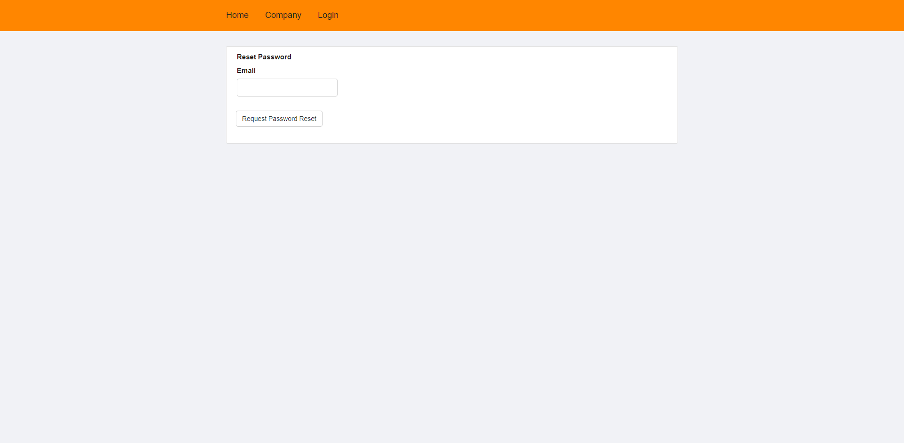
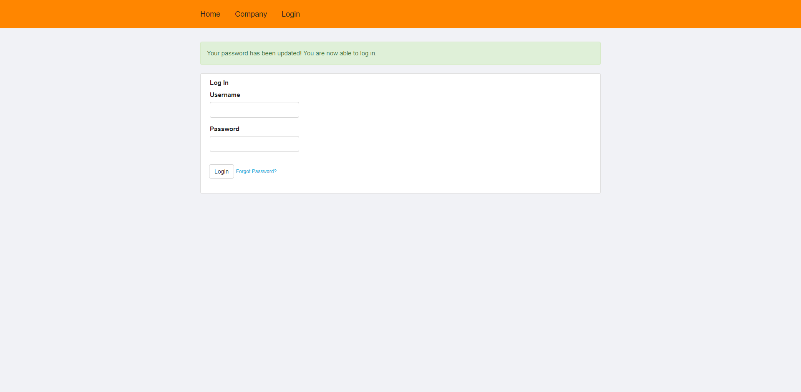

# pia

KIV/PIA

## Pre-filled data

## Users

Administrator and 2 users from each role

| Login    | Password | Role          |
|----------|----------|---------------|
| Admin001 | 1234     | administrator |
| User0001 | 0001     | accountant    |
| User0002 | 0002     | accountant    |

## Create secret key

```python
import secrets

secrets.token_hex(16)
```

## Docker

Remove Docker images: `docker rm -f $(docker ps -aq)`.

### Spuštění aplikace

Pro spuštění práce pro její otestování by mělo stačit spustit dva následující řádky pro Docker.

```shell script
$ docker build -f Dockerfile -t pia-flask:latest .
$ docker run -p 5000:5000 --rm -e LC_ALL=C.UTF-8 -e LANG=C.UTF-8 -e FLASK_ENV=development -e FLASK_DEBUG=0 -e FLASK_APP=app.py pia-flask
```

Endpoint: `http://192.168.99.100:5000/` (v mém případě).

## Password reset

Pro zprovoznění resetování hesla musí být nastaveno `app.testing = False` a doplněny v konfiguraci údaje `MAIL_USERNAME` a `MAIL_PASSWORD` pro `mailtrap.io` (nebo nějakého jiného poskytovatele pro posílání emailů).

Jakmile je nastaveno `app.testing = False`, tak nefunguje CAPTCHA, protože tu mám pouze v testovacím režimu.
Sice funguje, ale není napojená na můj Google účet.

Jako důkaz, že resetování hesla funguje, bude tedy muset pravděpodobně stačit jen několik screenshotů, které mohu poskytnout.

### Krok 1 - zadání emailu pro zaslání resetovacího odkazu



### Krok 2 - Přihlašovací obrazovka s hláškou o úspěšném zaslání emailu s resetovacím odkazem


### Krok 3 - Email s resetovacím odkazem


### Krok 4 - Obrazovka pro zadání nového hesla


### Krok 5 - Přihlašovací obrazovka s hláškou o úspěšném resetování hesla



## Testování

Z principu toho, jak je aplikace ve frameworku Flask napsaná není bohužel moc co testovat (nebo mě nenapadá co a jak - alespoň, co se týká user managementu).
Ukázkový jednotkový test je vypracovaný v souboru `tests.py`.

## Databáze

### Vytvoření

Databázi je možné vytvořit postupným spuštěním skriptů:

1. `scripts/create_db.py`
2. `scripts/create_users_roles.py`
3. `scripts/import_to_db.py`

V repozitáři je ale commitnutá již předvyplněná DB SQLite, takže pro kontrolu práce je není třeba spouštět.

### Schéma


## Other

### Dynamic fields

https://www.rmedgar.com/blog/dynamic_fields_flask_wtf
